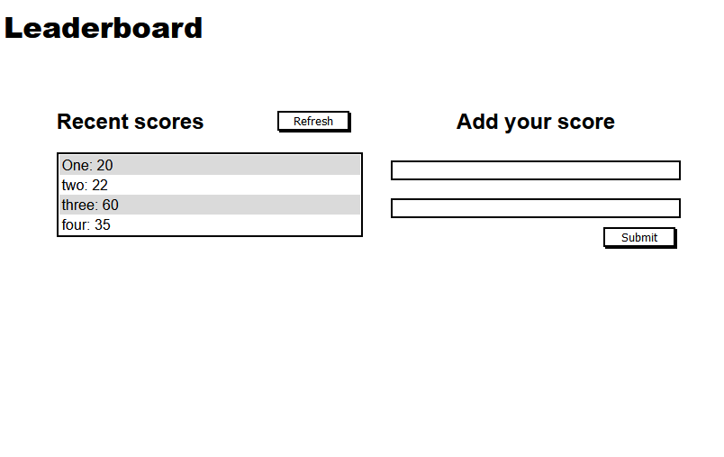

# Leaderboard

> This project is about building an app uses Api calls. 

Here is an app where you can add your different names and scores and see the list of all the scores
## Built With

- Javascript
- HTML
- CSS

## Usage

- Clone the repo 
- open it on your IDE
- open the terminal and run 'npm install'
- then run 'npm run build'
- finally run 'npm start'
## Authors

👤 **Caleb Moses**

- Github: [@m05e5](https://github.com/m05e5)
- Linkedin: [caleb Moses](https://www.linkedin.com/in/caleb-moses-0a1b531b9/)

## Show your support

Give a ⭐️ if you like this project!

## 📝 License

This project is MIT Lisenced
